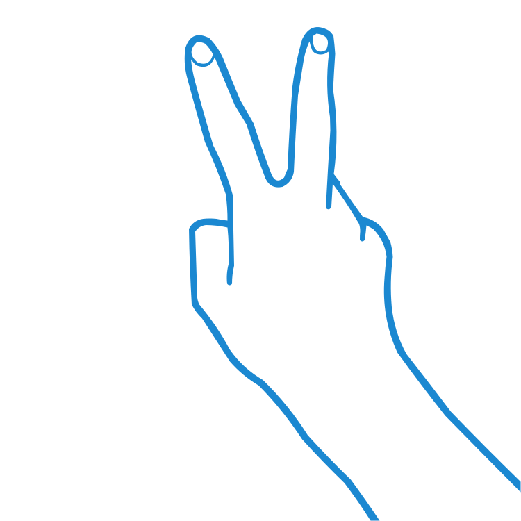

# Gesys
Gesys is an evolving module that provides a high-level API for recognizing hand gestures using a webcam

# Get started
**Install gesys module**
```python
pip install gesys
```
**Run simple example**
```python
from gesys.preview import preview

preview(speed_mode=2)
```

# Available gestures
<div>
    <style>
        .diver{
            background-color: 'black';
        }
    </style>
    <div class='diver' style='width: 100%; height: 200px; display: flex; flex-direction: column; padding:5px; gap: 5px'>
        <div style='display:flex; height:100px; gap: 20px'>
            <div style='background-color:#007acc; height: 100%; border-radius: 50%; overflow:hidden'>
                
            </div>
            <div style='color: #dddddd; font-size: 30px; height:92.5px; line-height:92.5px'>Open palm</div>
        </div>
        <div style='display:flex; height:100px; gap: 20px'>
            <div style='background-color:#1e1e1e; height: 100px; border-radius: 50%; overflow:hidden'>
                
            </div>
            <div style='color: #dddddd; font-size: 30px; height:92.5px; line-height:92.5px'>Two up</div>
        </div>
    </div>
</div>

